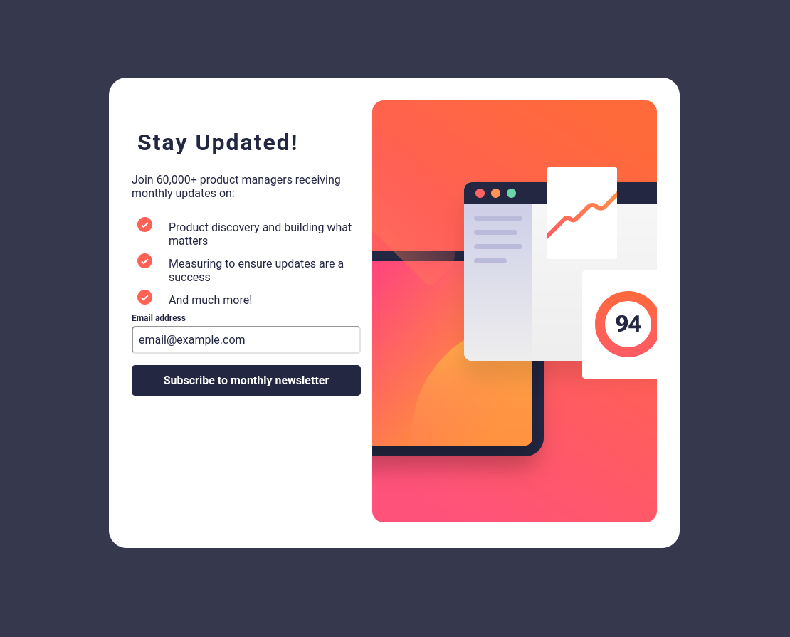

# Frontend Mentor - Newsletter sign-up form with success message solution

This is a solution to the [Newsletter sign-up form with success message challenge on Frontend Mentor](https://www.frontendmentor.io/challenges/newsletter-signup-form-with-success-message-3FC1AZbNrv). Frontend Mentor challenges help you improve your coding skills by building realistic projects. 

## Overview

### The challenge

Users should be able to:

- Add their email and submit the form
- See a success message with their email after successfully submitting the form
- See form validation messages if:
  - The field is left empty
  - The email address is not formatted correctly
- View the optimal layout for the interface depending on their device's screen size
- See hover and focus states for all interactive elements on the page

### Screenshot

### Links

- [My Repository](https://github.com/noahspoling/frontendmentor-newsletter-sign-up)
- [Live Site](https://noahspoling.github.io/frontendmentor-newsletter-sign-up/)

## My process

### Built with

- [ArrowJS](https://www.arrow-js.com/) - Reactive Static JS library

**Note: These are just examples. Delete this note and replace the list above with your own choices**

### What I learned

Most of my frontend mentor work is around ArrowJS. It has a lot of transferable knowledge to vanilla JS and it helps that Github can deploy it as a static site.

## Author

- Website - [Portfolio Website](https://www.noahspoling.com)
